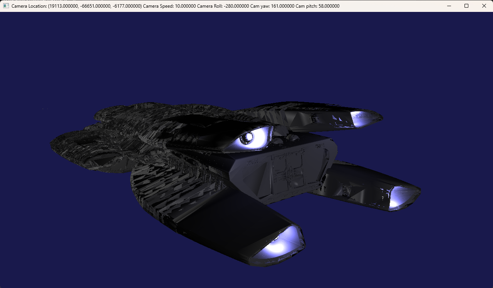
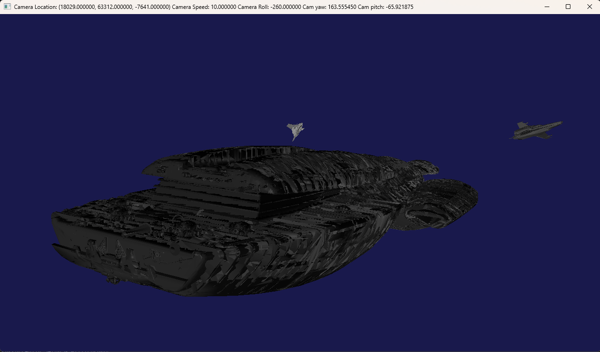
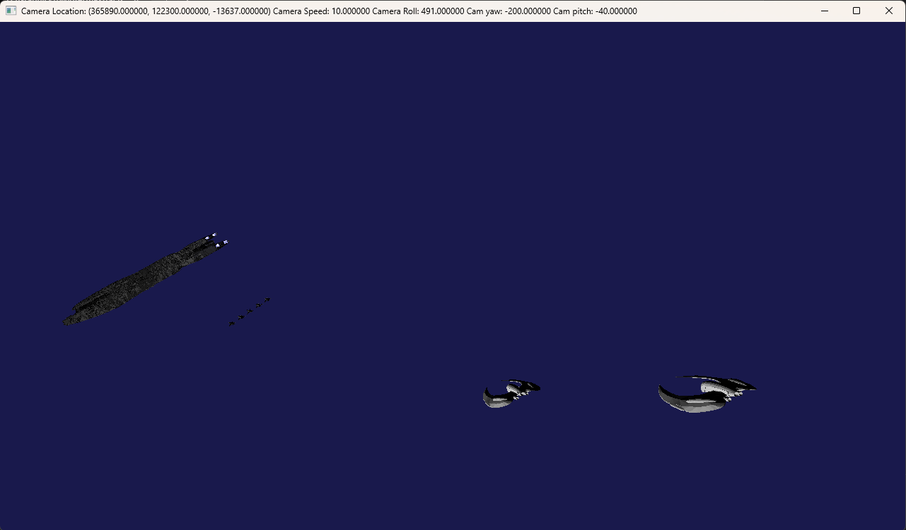
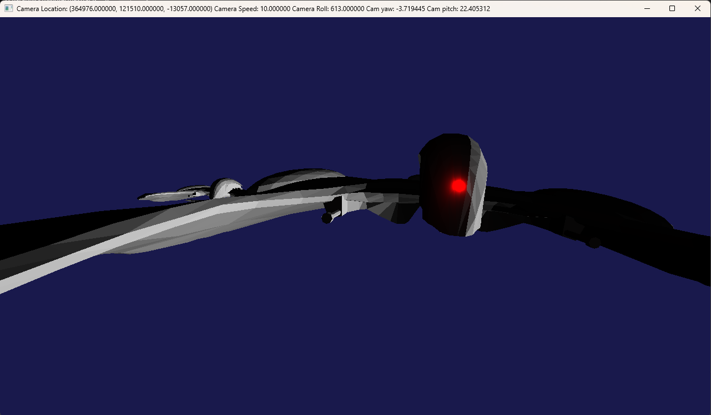

# OpenGL_Graphics_Project4
This is a graphics project coded totally in C++ using OpenGL, GLAD, GLFW and in my own custom game engine!

## SHORTCUTS:
9: Camera to back of Galactica

0: Camera back to original scene

8: Camera showing 5 vipers and 2 cylons and they will also start animating if you press this, also the bullets will animate

7: Start animation of 5 vipers

6: Camera showing eye thingy of cylon

5: Camera showing bullets in space

3: GL_FILL

2: GL_LINE

1: GL_POINT
